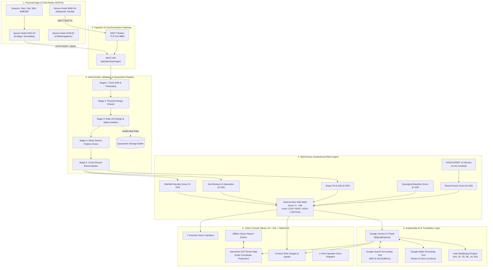
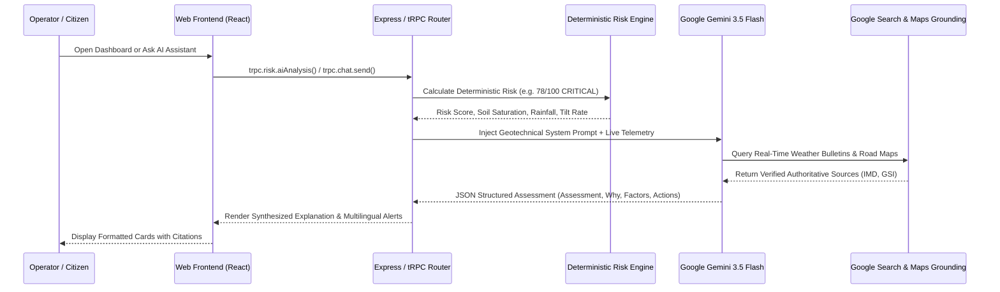

# 🏗️ 02. Complete System Architecture & Data Engineering

> **A Deep Technical & Conceptual Architecture Guide**  
> *Detailed data pipelines, mathematical formulas, deterministic quarantine rules, AI grounding mechanisms, and system workflows.*

---

## 🏛️ 1. High-Level Architectural Topology

Landsora is engineered as a modern, full-stack, type-safe decision-support system. It decouples the client user interface, the server processing pipeline, the external data integrations, and the physical edge hardware into distinct, auditable layers:



---

## 🛡️ 2. The 5-Stage Deterministic Validation & Anomaly Quarantine Pipeline

Sensors deployed on wild, rugged mountains face extreme weather, insect infestation, battery degradation, and mechanical shocks (e.g. monkeys jumping on a sensor mast, falling tree branches). 

To prevent faulty hardware from triggering mass community evacuations, every telemetry packet must pass through a **5-stage deterministic validation pipeline** implemented in `server/services/anomalyValidationService.ts`.

```
                    INCOMING TELEMETRY READING
                                │
                                ▼
  ┌─────────────────────────────────────────────────────────────┐
  │ STAGE 1: Timestamp & Clock Drift Validation                 │
  │ • TIME-01: Malformed ISO date?            ──► -40 pts       │
  │ • TIME-02: Future clock drift (>2 min)?   ──► -25 pts       │
  │ • TIME-03: Stale reading (>30 min)?       ──► -30 pts       │
  └─────────────────────────────┬───────────────────────────────┘
                                │
                                ▼
  ┌─────────────────────────────────────────────────────────────┐
  │ STAGE 2: Physical Boundary & Range Checks                   │
  │ • RANGE-01: Negative rainfall (<0 mm)?    ──► -50 pts (CRIT)│
  │ • RANGE-02: Impossible rain (>150 mm/hr)? ──► -35 pts       │
  │ • RANGE-03: Soil moisture outside 0-100%? ──► -40 pts (CRIT)│
  │ • RANGE-04: Slope tilt angle > ±45°?      ──► -45 pts       │
  │ • HW-01:    Battery voltage < 3.3V?       ──► -15 pts (WARN)│
  └─────────────────────────────┬───────────────────────────────┘
                                │
                                ▼
  ┌─────────────────────────────────────────────────────────────┐
  │ STAGE 3: Rate-of-Change & Sudden Spike Check                │
  │ • SPIKE-01: Instantaneous tilt jump > 0.08° in 2.5s step?   │
  │   ──► CRITICAL: Flagged as mechanical shock or sensor glitch│
  │   ──► -60 pts penalty & AUTOMATIC QUARANTINE ISOLATION      │
  └─────────────────────────────┬───────────────────────────────┘
                                │
                                ▼
  ┌─────────────────────────────────────────────────────────────┐
  │ STAGE 4: Stuck Sensor Flatline Detection                    │
  │ • FLATLINE-01: Soil moisture unchanged over 8 consecutive   │
  │   samples despite active rainfall >10 mm/hr?                │
  │   ──► Sensor probe is clogged/dead! -25 pts penalty         │
  └─────────────────────────────┬───────────────────────────────┘
                                │
                                ▼
  ┌─────────────────────────────────────────────────────────────┐
  │ STAGE 5: Cross-Source Reconciliation                        │
  │ • CROSS-01: Local rain gauge differs by >25 mm/hr from      │
  │   regional satellite / meteorological radar API?            │
  │   ──► -20 pts penalty (Warning flag for field surveyor)     │
  └─────────────────────────────┬───────────────────────────────┘
                                │
                                ▼
                  COMPUTED DATA CONFIDENCE SCORE
                  ┌────────────────────────────┐
                  │ Confidence Score: 0 - 100% │
                  │ Status: ACCEPTED /         │
                  │   ACCEPTED_WITH_WARNING /  │
                  │   QUARANTINED / REJECTED   │
                  └────────────────────────────┘
```

### 🔒 Safe Fallback Substitution on Quarantine
When a reading is quarantined (e.g., due to a `SUDDEN_SPIKE` or `IMPOSSIBLE_VALUE`), Landsora does **NOT** let the corrupted value enter the risk engine. Instead:
- It isolates the raw reading into the `QuarantineRecord` buffer for engineering audit.
- It substitutes the bad metric with the last-known validated reading or calibrated baseline (e.g. replacing a faulty $999\text{ mm}$ spike with the previous step's $12.0\text{ mm}$).
- This ensures the live risk engine remains running smoothly and never triggers false alarms.

---

## 📊 3. The 4-Factor Deterministic Risk Engine

Landsora calculates risk using two complementary, transparent mathematical formulas.

### 🧮 Formula A: 4-Factor Equal Weight Score (`server/services/riskEngine.ts`)

Used when integrating simulated zone telemetry, historical baselines, and NASA global event tracking:

$$\text{Risk Score} = \text{round}\left( \frac{\text{RainfallScore} + \text{TerrainTiltScore} + \text{HistoricalScore} + \text{RecentEventScore}}{4} \right)$$

Where each component is clamped between $0$ and $100$:
- **Rainfall Score ($0 - 100$)**: Normalized against critical precipitation thresholds ($32\text{ mm/hr}$ peak).
- **Terrain Tilt Score ($0 - 100$)**: Normalized against angular micro-displacement ($0.16^\circ\text{/hr}$ creep rate).
- **Historical Baseline Score ($0 - 100$)**: Pre-configured geological susceptibility index for specific mountain ghats (e.g., Wayanad = 85, Darjeeling = 78, Nilgiris = 72, Kodagu = 68, Chikkamagaluru = 55, Uttara Kannada = 45).
- **Recent Event Score ($0 - 100$)**: Proximity density of verified natural hazard events from NASA EONET within the monitored coordinate bounding box.

### ⚙️ Formula B: Hardware Telemetry Weighted Geotechnical Score (`server/services/hardwareIngestService.ts`)

Used for real-time ESP32 edge microcontroller ingestion:

$$\text{Risk Score} = \text{round}\left( 0.40 \cdot S_{\text{rainfall}} + 0.35 \cdot S_{\text{soil}} + 0.25 \cdot S_{\text{tilt}} \right)$$

Where:
- $S_{\text{rainfall}} = \min\left(100, \frac{\text{Rainfall (mm/hr)}}{30} \times 100\right)$ (40% Weight - Primary Trigger)
- $S_{\text{soil}} = \min\left(100, \text{Soil Moisture (\%)}\right)$ (35% Weight - Pore Saturation Loading)
- $S_{\text{tilt}} = \min\left(100, \frac{\text{Tilt Angle (}^\circ)}{10} \times 100\right)$ (25% Weight - Mechanical Movement)

### 🚦 Classification Risk Bands

| Score Range | Risk Level | Visual Status | Recommended Action Protocol |
|---|---|---|---|
| **$0 - 25$** | `LOW` | 🟢 Green | Nominal conditions. Standard 2.5s IoT heartbeat logging. |
| **$26 - 50$** | `MODERATE` | 🟡 Yellow | Saturated topsoil. Alert field surveyors to monitor culvert runoff. |
| **$51 - 75$** | `HIGH` | 🟠 Orange | Significant pore pressure & micro-tilt. Prepare village evacuation shelters. |
| **$76 - 100$** | `CRITICAL` | 🔴 Red | Imminent slope failure. 1-click authority siren dispatch & road closure. |

---

## 🛰️ 4. NASA EONET v3 Integration & Caching Layer

`server/services/eonetService.ts` connects Landsora to NASA's global natural hazard registry:
- **API Endpoint**: `https://eonet.gsfc.nasa.gov/api/v3/events?category=landslides&status=open&limit=100`
- **Data Normalization**: Converts NASA's multi-layered GeoJSON schema into lightweight, unified records:
  ```typescript
  type EonetEvent = {
    id: string;
    title: string;
    date: string;
    latitude: number;
    longitude: number;
    source: string;
    status: "open" | "closed";
  };
  ```
- **In-Memory Cache (5 Minutes)**: `CACHE_MS = 300,000`. Caches API responses in RAM to eliminate redundant external HTTP requests and prevent upstream rate-limiting.
- **Fail-Safe Circuit Breaker**: Uses an `AbortController` with an 8-second timeout. If NASA's servers are unreachable, the service gracefully returns `available: false` with fallback domain data, ensuring the dashboard never hangs or crashes.

---

## 🤖 5. Explainable AI Decision Support Layer (Google Gemini 3.5 Flash)

Landsora leverages **Google Gemini 3.5 Flash** (`@google/genai`) to provide grounded, domain-specific disaster intelligence without sacrificing safety:



### 🎭 3 Specialized Persona Roles
In `server/services/geminiAiService.ts`, three distinct persona instructions are available:
1. **`GEOTECHNICAL_SPECIALIST`**: Analyzes shear strength, pore water pressure, micro-tilt displacement, and geological stratigraphy (laterite vs gneiss).
2. **`DISASTER_COORDINATOR`**: Translates risk metrics into evacuation corridors, relief camp logistics, and road pass safety.
3. **`FIELD_SURVEYOR`**: Guides technicians on ESP32 pinouts, soil sensor calibration curves, and battery voltage troubleshooting.

---

## 🌐 6. 5-Language Indic Alert & Translation Matrix

To serve mountain communities across South and North India, Landsora provides a dual-layer localization engine:
1. **Pre-Compiled Linguistic Matrix (`client/src/lib/notificationTranslations.ts`)**: Instant, zero-latency notification templates across 5 major languages:
   - **English (`EN`)**
   - **Kannada (`KN` - ಕನ್ನಡ)**
   - **Tamil (`TA` - தமிழ்)**
   - **Telugu (`TE` - తెలుగు)**
   - **Malayalam (`ML` - മലയാളം)**
2. **Dynamic Google Translate Proxy (`server/services/googleTranslateService.ts`)**: Real-time batch translation supporting 30+ world languages with in-memory LRU caching.

---

## 📱 7. Offline-First Citizen Incident Reporting Architecture

In mountain terrain, cellular networks frequently fail during severe storms. Landsora implements an offline-first reporting pipeline:
- **Local Storage Queue (`client/src/lib/reportQueue.ts`)**: Citizen reports (crack width, location, hazard severity, photo metadata) are saved to browser `localStorage` under `lews-report-queue`.
- **GPS Geolocation Fallback**: Uses the HTML5 Geolocation API (`navigator.geolocation`) with a graceful fallback allowing users to click directly on the GIS map if GPS satellite lock is obstructed by steep cliff walls.
- **Sync Reconciliation (`server/services/reportSyncService.ts`)**: When connectivity is restored, the queue automatically syncs with the server incident triage deck.

---

## 🤝 8. Community Ground Intelligence (No-Sensor Rural Monitoring)

Community Ground Intelligence is an additive monitoring layer for rural areas where physical field sensors have not yet been installed. It does not modify the existing live console, telemetry pipeline, risk score, or warning controls.

### Public entry points

The client exposes the feature through separate routes:

- **`/community-ground-intelligence`** — report form, offline status, advisory, public-data context, community map, and expansion roadmap.
- **`/community-reports`** — saved community report cards and media previews.
- **`/report-review`** — protected review workspace for authenticated administrators.

The landing page adds **Report Ground Condition** as a new navigation action while retaining every existing navigation item and console action.

### Report schema and local durability

Residents, drivers, volunteers, farmers, local officials, and emergency workers can submit:

- Category: cracks, rockfall, mudslide, blocked drainage, seepage, leaning trees or poles, road blockage, unusual slope activity, or other.
- Severity: `Low`, `Moderate`, `High`, or `Critical`.
- Description, optional photo, optional short video, GPS coordinates or a manually selected map coordinate.
- Optional reporter name and phone number, observation date/time, and explicit consent.

Until a community-report backend is connected, reports are serialized in browser `localStorage` under `landsora-community-ground-reports`. Each newly submitted record starts at **`Pending upload`**. A temporary loss of connectivity does not discard the record; the UI shows the offline state and reports remain visible in the Community Reports page. When the browser returns online, the client attempts synchronization and explicitly leaves records queued when no backend is configured rather than pretending that upload succeeded.

### Review and verification lifecycle

The public dashboard exposes report content and provenance, but never administrator controls. The review route checks both authentication and the existing `user.role === "admin"` authorization value before rendering review controls. Authorized reviewers can filter by category, severity, status, and location coordinates; sort by newest or highest severity; add notes; and transition reports through:

```text
Pending upload → Unverified → Under review → Corroborated → Field verified → Closed
```

`Corroborated` and `Field verified` are reviewer states, not automated claims. Community reports are never treated as equivalent to physical sensors.

### Map and public-data rules

The separate community map renders report markers only, with the following state colors:

- Gray — Pending upload
- Yellow — Unverified
- Orange — Under review
- Blue — Corroborated
- Red — Field verified high-severity report
- Green — Closed

The map does not add fictional sensor stations. Rainfall, weather, terrain, historical incidents, and satellite observations are marked unavailable until a real connected source provides a timestamped value. Every public-data card displays source, timestamp, age, confidence, data type, and availability.

The Community Advisory card is decision support only and includes the following safety boundary:

> This is an automated advisory based on available public data and community reports. It is not an official evacuation order. Follow instructions from local authorities.

The feature is explicitly labeled: **Community and public-data feature — physical field sensors are not yet installed.**

### Expansion roadmap

The additive roadmap is intentionally separate from the current operational console:

1. Public data and community reporting.
2. Partnerships with local authorities and universities.
3. Pilot rain gauges and ground sensors.
4. Validated local early-warning system.

---

## 🔄 9. End-to-End Data Lifecycle Walkthrough

To see how all these pieces fit together, let's trace a single physical event from the mountain slope to the operator's screen:

1. **Physical Event (0.0s)**: A heavy monsoon cloudburst dumps $45\text{ mm/hr}$ of rain on a steep ridge in Kodagu, Karnataka.
2. **Sensor Capture (0.1s)**: 
   - The tipping-bucket rain gauge reed switch clicks repeatedly, firing hardware interrupts on ESP32 **GPIO 4**.
   - The capacitive probe on **GPIO 34** reads $88\%$ volumetric moisture.
   - The MPU6050 accelerometer over **I2C (GPIO 21/22)** detects a $0.095^\circ$ angular tilt drift.
3. **Edge Transmission (2.5s)**: The ESP32 formats a JSON packet and sends an HTTP POST request to `/api/telemetry/ingest`.
4. **Validation Pipeline (2.6s)**: The server verifies the timestamp, confirms rainfall is within $0-150\text{ mm}$, checks battery is healthy ($3.92\text{V}$), and flags a Data Confidence Score of $96\%$.
5. **Risk Engine (2.7s)**: The deterministic algorithm computes a risk index of **$84/100$ (`CRITICAL`)**.
6. **AI Synthesis (3.5s)**: Gemini 3.5 Flash synthesizes the situation report: *"Critical slope instability detected at Kodagu. Pore water pressure exceeds shear threshold."*
7. **Client Rendering (3.6s)**: 
   - The GIS Map turns the Kodagu marker glowing red with pulsating alarm ripples.
   - The Risk Gauge spikes to 84.
   - A critical audio alert sounds on the console.
   - A Kannada SMS advisory is prepared: *"ಕೊಡಗು ಪ್ರದೇಶದಲ್ಲಿ ತೀವ್ರ ಭೂಕುಸಿತದ ಅಪಾಯ ಪತ್ತೆಯಾಗಿದೆ..."*
8. **Operator Action (5.0s)**: The field officer clicks **"Authorize Siren & Mass SMS Broadcast"**, sending life-saving warnings to 24 village panchayats in seconds.
